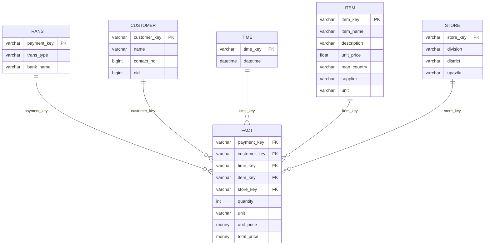

```mermaid
erDiagram
    CUSTOMER {
        varchar customer_key PK
        varchar name
        bigint contact_no
        bigint nid
    }
    
    ITEM {
        varchar item_key PK
        varchar item_name
        varchar description
        float unit_price
        varchar man_country
        varchar supplier
        varchar unit
    }
    
    STORE {
        varchar store_key PK
        varchar division
        varchar district
        varchar upazila
    }
    
    TIME {
        varchar time_key PK
        datetime datetime
    }
    
    TRANS {
        varchar payment_key PK
        varchar trans_type
        varchar bank_name
    }
    
    FACT {
        varchar payment_key FK
        varchar customer_key FK
        varchar time_key FK
        varchar item_key FK
        varchar store_key FK
        int quantity
        varchar unit
        money unit_price
        money total_price
    }
    
    TRANS ||--o{ FACT : "payment_key"
    CUSTOMER ||--o{ FACT : "customer_key"
    TIME ||--o{ FACT : "time_key"
    ITEM ||--o{ FACT : "item_key"
    STORE ||--o{ FACT : "store_key"
```
