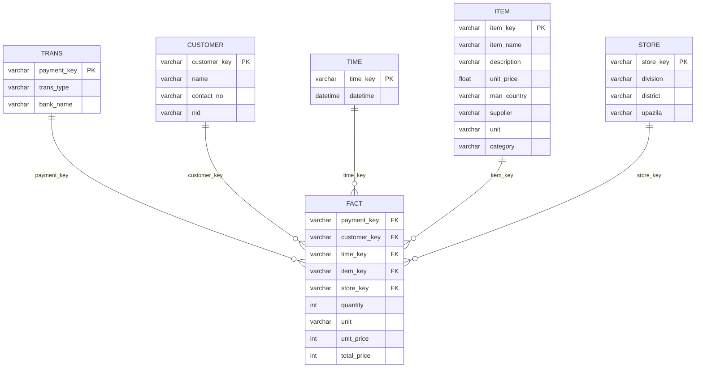

# ECommerce Data Analysis Graduation Project
This project aims to put a spotlight on many skills a data analyst should acquire in his pocket. While the data was already there, formatted as `.CSV` files, we ran through various data analysis phases. From investigation and cleaning the data, going through building an actual database to analyzing and reporting our valuable insights.

In this repo we're going to explain what we actually did and how we did it in detail, you can find all the files we used to get this mission accomplished [here](https://github.com/ahmedgalaalali/E-commerce-Data-Analysis-Graduation-Project), and I wish you enjoy the journey because it's going to take a while. HAVE FUN!

## Data Source and Information
* **Data Source**: [ECommerce Data Analysis](https://www.kaggle.com/datasets/mohainimulislams/ecommerce-data-analysis)
* **Information**:
  * *Publisher*: [M Mohainimul Islam](https://www.kaggle.com/mohainimulislam)
  * *Details*: This info was not provided by the publisher, however, after diving deep into the data, we found that this data was recorded by `726` stores located in different divisions in **Bangladesh**, these stores are responsible for selling different categories of products such as (Skin, Kitchen Supplies, Medicine, Beverage, Coffee Supplies, Dishware, Food). The data was recorded in a period from 2014 to 2021. He asked for insights about many topics like (sales patterns, customer behavior, product trends, key growth opportunities and actionable recommendations), SO WE DID!

## Tools Used:
| Tool | Purpose |
|------|---------|
| Python | Data cleaning, investigation, analysis and machine learning |
| PostgreSQL | Database management and data warehouse |
| Power BI | Dashboard and report |
| MS PowerPoint | Final presentation |

## Phase 1: Data Cleaning and Investigations
- **All the cleaning, preparation and pre-investigation findings can be found in the [Data Cleaning Phase](https://github.com/ahmedgalaaali/E-commerce-Data-Analysis-Graduation-Project/blob/main/Data%20Cleaning%20Phase.ipynb) notebook**.
- Key findings and changes made:

| Table | Changes | 
|------|---------|
| Customer | Filled `NA` values in `name` column with "Anonymous Customer" |
| Item | Filled with `pack` after looking up the item name*   Created new columns suing certain calculations using `SQL`  |
| Fact | Filled `NA` values with `pack`* |
| Store | The data was ready to enter ther database without changes |
| Time | The table is now composed of two well formatted columns, `time_key` & `datetime` |
| Trans | Filled `NA` values in `bank_name` column with **Unknown** |
