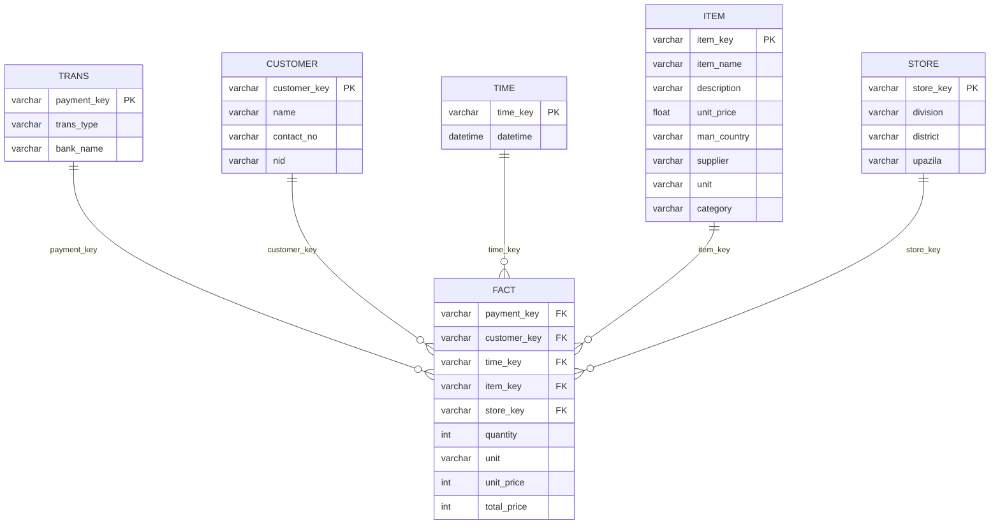

# ECommerce Data Analysis Graduation Project
This project aims to put a spotlight on many skills a data analyst should acquire in his pocket. While the data was already there, formatted as `.CSV` files, we ran through various data analysis phases. From investigation and cleaning the data, going through building an actual database to analyzing and reporting our valuable insights.

In this repo we're going to explain what we actually did and how we did it in detail, you can find all the files we used to get this mission accomplished [here](https://github.com/ahmedgalaalali/E-commerce-Data-Analysis-Graduation-Project), and I wish you enjoy the journey because it's going to take a while. HAVE FUN!

## 📑 Navigation

- [Data Source and Information](#data-source-and-information)
- [Tools Used](#tools-used)
- [Database ERD](#database-erd)
- [Phase 1: Data Cleaning and Investigations](#phase-1-data-cleaning-and-investigations)
- [Phase 2: Database Building](#phase-2-database-building)
  - [SQL Code Details](#sql-code-details)
    - [Tables creation](#1tables-creation)
    - [Importing the data](#2-importing-the-data)
    - [Foreign keys](#3-foreign-keys)
    - [Changes applied using SQL](#3-changes-applied-using-sql)
- [Predictive Analysis](#predictive-analysis)
  - [RFM Customer Segmentation](#rfm-customer-segmentation-part-of-e-commerce-analysis-project)
  - [Customer Clustering](#customer-clustering)
  - [Visualizations](#visualizations)
  - [Insights from Clustering](#insights-from-clustering)
  - [Tools & Libraries](#tools--libraries)
  - [Executive Summary](#executive-summary)
  - [1. Revenue & Transactional Performance](#1-revenue--transactional-performance)
  - [2. Category-wise Revenue Breakdown](#2-category-wise-revenue-breakdown)
  - [3. Time Series Sales Analysis (2014–2021)](#3-time-series-sales-analysis-2014–2021)
  - [4. Customer Behavior & Growth Insights](#4-customer-behavior--growth-insights)
  - [5. Key Insights & Strategic Implications](#5-key-insights--strategic-implications)
  - [6. Recommendations](#6-recommendations)

## Data Source and Information
* **Data Source**: [ECommerce Data Analysis](https://www.kaggle.com/datasets/mohainimulislams/ecommerce-data-analysis)
* **Information**:
  * *Publisher*: [M Mohainimul Islam](https://www.kaggle.com/mohainimulislam)
  * *Details*: This info was not provided by the publisher, however, after diving deep into the data, we found that this data was recorded by `726` stores located in different divisions in **Bangladesh**, these stores are responsible for selling different categories of products such as (Skin, Kitchen Supplies, Medicine, Beverage, Coffee Supplies, Dishware, Food). The data was recorded in a period from 2014 to 2021. He asked for insights about many topics like (sales patterns, customer behavior, product trends, key growth opportunities and actionable recommendations), SO WE DID!

## Tools Used:
| Tool | Purpose |
|------|---------|
| Python | Data cleaning, investigation, analysis and machine learning |
| PostgreSQL | Database management and data warehouse |
| Power BI | Dashboard and report |
| MS PowerPoint | Final presentation |

## Database ERD

## Phase 1: Data Cleaning and Investigations
- **All the cleaning, preparation and pre-investigation findings can be found in the [Data Cleaning Phase](https://github.com/ahmedgalaaali/E-commerce-Data-Analysis-Graduation-Project/blob/main/Data%20Cleaning%20Phase.ipynb) notebook**.
- Key findings and changes made:

| Table | Changes | 
|------|---------|
| Customer | Filled `NA` values in `name` column with "Anonymous Customer" |
| Item | Filled with `pack` after looking up the item name* <br> Created new columns suing certain calculations using `SQL`<br> |
| Fact | Filled `NA` values with `pack`* |
| Store | The data was ready to enter ther database without changes |
| Time | The table is now composed of two well formatted columns, `time_key` & `datetime` |
| Trans | Filled `NA` values in `bank_name` column with **Unknown** |

## Phase 2: Database Building
- An `SQL` file was created to do all the configurations. The whole code could be found in the [Database Structure](https://github.com/ahmedgalaaali/E-commerce-Data-Analysis-Graduation-Project/blob/main/Database%20Structure.sql) file.
- The **DBMS** used here was **PostgreSQL**.
---
### SQL Code Details:
---

**We highly recommend taking a look on the previous [Database ERD](#database-erd) to make it easier to understand the highlights below**

### 1.Tables creation
<br>

Iside the code, we created the tables using `CREATE TABLE table_name(col1 DATATYPE1, ...);`
<br>

> Example of the code:

```sql
CREATE TABLE customer(
                    customer_key VARCHAR(25) PRIMARY KEY,
                    name VARCHAR(50),
                    contact_no VARCHAR,
                    nid VARCHAR);
```
---
### 2. Importing the data

<br>

As we've been using **PostgreSQL**, it was much easier to use the `COPY FROM` method, so that's were you identify the table you want to import the data in, and then the path you're grabbin gthe data from.
<br>

> Example of the code:
```sql
COPY customer(customer_key,name,contact_no,nid)
FROM 'C:\Mine\My Projects\E-commerce database\CSV\customer.csv'
DELIMITER ','
CSV HEADER;
```
> **Note:** 
<br>
The table defined in the previous code should carry the same structure of the data that needs to be imported, otherwise, the DBMS will raise an error.
<br>
The whole schema was built using the same way identified above, as well as importing the data into the tabls.
<br>
---
### 3. Foreign keys
<br>
In order to relate each table to the main `Fact` table we needed to identify the foreign keys of each dimentional table in the schema, so we did.

> Code used:

```sql
ALTER TABLE fact
ADD CONSTRAINT fk_payment FOREIGN KEY (payment_key) REFERENCES trans(payment_key),
ADD CONSTRAINT fk_customer FOREIGN KEY (customer_key) REFERENCES customer(customer_key),
ADD CONSTRAINT fk_time FOREIGN KEY (time_key) REFERENCES time(time_key),
ADD CONSTRAINT fk_item FOREIGN KEY (item_key) REFERENCES item(item_key),
ADD CONSTRAINT fk_store FOREIGN KEY (store_key) REFERENCES store(store_key);
```
---
### 3. Changes applied using SQL
During the analysis phase, we decided that there are some changes that need to be applied, the easiest and fastest way to apply it was using the actual SQL code we use to alter the database, this will ensure:
- Well-built pipelines.
- Well-maintained data flow.
- Changes apply automatically in case if we got new data entering the database.
#### 1. Replaced "Unknown" values with "Cash Payment" in the `trans` table
> Code used:
```sql
UPDATE trans
SET bank_name = 'Cash Payment'
WHERE bank_name = 'Unknown'
```
#### 2. Created a column `category` to categorize the items based on the `description` column in `item` table
> Code used:
```sql
ALTER TABLE item
ADD COLUMN category VARCHAR
GENERATED ALWAYS AS (
    CASE
        WHEN description LIKE '%Beverage%' THEN 'Beverage'
        WHEN description LIKE '%Coffee%' THEN 'Coffee Supplies'
        WHEN description LIKE '%Dishware%' THEN 'Dishware'
        WHEN description LIKE '%Food%' THEN 'Food'
        WHEN description LIKE '%Gum%' THEN 'Gum'
        WHEN description LIKE '%Kitchen Supplies%' THEN 'Kitchen Supplies'
        WHEN description LIKE '%Medicine%' THEN 'Medicine'
        ELSE NULL
    END
) STORED;
```
> **The purpose of this is to make a slicer that has the categories in comprehensive words rather than using the whole description as a filter in Power BI**
#### 3. Typos in the `unit` column `item` table
We noticed that the `unit` column containes a number of typos so we changed them to the propper structure also using SQL.
> Code used:
```sql
UPDATE item
SET unit = CASE 
    WHEN unit IN('ct','ct.', 'Ct') THEN 'count'
    WHEN unit IN('oz','oz.') THEN 'ounce'
    WHEN unit = 'pk' THEN 'pack'
    WHEN unit = 'botlltes' THEN 'bottles'
    WHEN unit = 'lb' THEN 'pounds'
    ELSE unit
END;
```

## Predictive Analysis

### RFM Customer Segmentation (Part of E-commerce Analysis Project)
---
### Project Context

This notebook is a **component of a larger E-commerce Data Analysis Project**.  
It focuses on segmenting customers based on their **RFM (Recency, Frequency, Monetary)** metrics and applying **KMeans clustering** to derive actionable customer groups.

This segmentation helps improve marketing, customer retention, and loyalty programs.

---

### RFM Explanation

| Metric   | Meaning                             | Calculation                                                  |
|----------|-------------------------------------|--------------------------------------------------------------|
| Recency  | How recently the customer purchased | Days since the last purchase                                 |
| Frequency| How often the customer purchased    | Total number of transactions per customer                    |
| Monetary | How much the customer spent         | Sum of all transaction values per customer                   |

---

### Steps Followed
---
### 1. Data Preparation
- Merged transactional data with time data using `time_key`.

### 2. RFM Metrics Calculation
```python
recency = df.groupby('customer_key')['date'].max()
frequency = df.groupby('customer_key')['payment_key'].count()
monetary = df.groupby('customer_key')['total_price'].sum()
```

### 3. Construct RFM Table
Combined Recency, Frequency, and Monetary into a single DataFrame `rfm_df`.

---

### Customer Clustering
---
### Clustering with KMeans
- Used `StandardScaler` for normalization.
- Applied **Elbow Method** to determine the best number of clusters.
- Used **KMeans** to segment customers.

```python
from sklearn.cluster import KMeans
kmeans = KMeans(n_clusters=4, random_state=42)
rfm_df['Cluster'] = kmeans.fit_predict(rfm_scaled)
```

---

## Visualizations

- **2D Seaborn Plots**: Recency vs Frequency & Frequency vs Monetary
- **3D Plotly Visualization**: Recency vs Frequency vs Monetary

These plots help visually understand customer clusters and patterns.

---

## Insights from Clustering

- **Cluster 3**: High-Value Customers → Low Recency, High Frequency, High Monetary
- **Cluster 0**: At-Risk Customers → High Recency, Medium Frequency
- **Cluster 1**: New or Low-Spend Customers → High Recency, Low Frequency

These insights can support marketing segmentation and campaign design.

---

## Tools & Libraries

- Python, Pandas, NumPy
- Scikit-learn, Plotly, Seaborn, Matplotlib
- Jupyter Notebook

## Executive Summary
This report provides a statistical and analytical overview of an 8-year eCommerce dataset comprising transactional and customer behavior insights. The objective is to evaluate revenue performance, category trends, customer dynamics, and temporal sales patterns to guide future strategic decisions.

---

## 1. Revenue & Transactional Performance

- **Total Revenue (2014–2021):** $105,401,435.75  
- **Total Transactions:** 1,000,000 transactions  
- **Average Order Value (AOV):** $105.40  
- **Number of Stores:** 726 stores across 7 divisions  

These figures indicate a robust business scale, with a strong order volume and a healthy AOV across a nationwide presence.

---

## 2. Category-wise Revenue Breakdown

| Category         | Revenue (USD)      | Percentage of Total Revenue |
|------------------|--------------------|------------------------------|
| Beverage         | $36,614,400.75     | 34.74%                       |
| Food             | $32,097,142.50     | 30.45%                       |
| Coffee Supplies  | $16,852,945.50     | 15.99%                       |
| Kitchen Supplies | $8,434,526.50      | 8.00%                        |
| Dishware         | $8,289,452.50      | 7.86%                        |
| Gum              | $2,448,854.00      | 2.32%                        |
| Medicine         | $664,114.00        | 0.63%                        |

- **Top-Selling Categories:** Beverage and Food generate 65.19% of the total revenue, confirming their dominance and critical business importance.  
- **Low-Performing Categories:** Medicine and Gum contribute less than 3%, signaling either niche roles or underperformance.

---

## 3. Time Series Sales Analysis (2014–2021)

Sales data exhibits consistent fluctuations, suggestive of seasonal buying behavior or event-based promotions (e.g., holidays, back-to-school seasons).  
- **Trend:** No clear long-term upward trend is observed, indicating stable but flat revenue growth.
- **Anomaly in January 2021:** Sales dipped sharply below 900,000 units, breaking prior seasonal patterns.

**Potential Causes:**
- Market Disruption (e.g., pandemic effects, regulatory changes)  
- Shifts in consumer preferences  
- Operational or supply chain issues  
- Competitor activity or pricing strategies  

---

## 4. Customer Behavior & Growth Insights

All customers were added in 2014, with rapid decline month-over-month, implying a closed customer ecosystem, with no new customers after August 2014.

### New Customer Acquisition (2014)

| Month | New Customers |
|-------|----------------|
| Jan   | 3640           |
| Feb   | 3857           |
| Mar   | 1206           |
| Apr   | 354            |
| May   | 79             |
| Jun   | 39             |
| Jul   | 15             |
| Aug   | 1              |

### Customer Activity (Last Transactions)

| Month     | Unique Customers |
|-----------|------------------|
| Jun 2020  | 1                |
| Jul 2020  | 6                |
| Aug 2020  | 10               |
| Sep 2020  | 55               |
| Oct 2020  | 190              |
| Nov 2020  | 681              |
| Dec 2020  | 2740             |
| Jan 2021  | 5508             |

Despite no new acquisitions post-2014, customer activity surged in late 2020, peaking in January 2021.

---

## 5. Key Insights & Strategic Implications

- **Customer Growth Concerns:**  
  - Auditing data integrity  
  - Investing in outreach/marketing  
  - Verifying if the dataset is a sample or anonymized scope

- **Revenue Concentration Risk:** Heavy reliance on a few categories can pose risk. Diversification or category innovation might be needed.

- **2021 Sales Drop:** Requires diagnostic investigation—potential causes include market shifts or internal disruption.

- **High AOV:** Suggests that current customers are spending well, but growth must come from expanding the base.

---

## 6. Recommendations

1. **Data Validation:** Confirm completeness and customer sampling strategy.
2. **Customer Acquisition Strategy:** Relaunch campaigns, loyalty programs, or partnerships to bring in new users.
3. **Category Development:** Analyze underperforming segments for repositioning or promotion.
4. **Anomaly Investigation:** Deep-dive into operational or external factors behind the Jan 2021 drop.
5. **Predictive Modeling:** Use RFM segmentation and clustering to optimize targeting and engagement.
