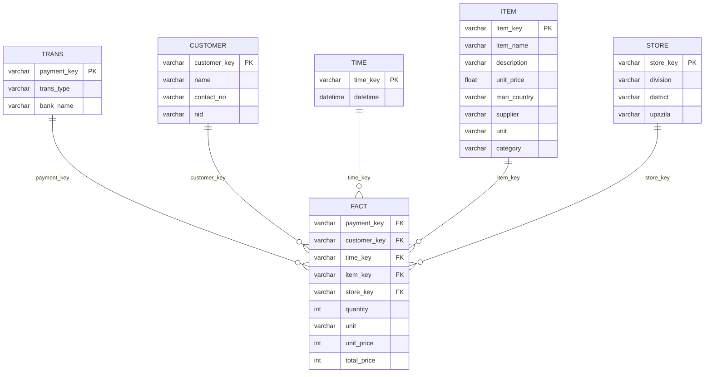

# ECommerce Data Analysis Graduation Project
This project aims to put a spotlight on many skills a data analyst should acquire in his pocket. While the data was already there, formatted as `.CSV` files, we ran through various data analysis phases. From investigation and cleaning the data, going through building an actual database to analyzing and reporting our valuable insights.

In this repo we're going to explain what we actually did and how we did it in detail, you can find all the files we used to get this mission accomplished [here](https://github.com/ahmedgalaalali/E-commerce-Data-Analysis-Graduation-Project), and I wish you enjoy the journey because it's going to take a while. HAVE FUN!

## Data Source and Information
* **Data Source**: [ECommerce Data Analysis](https://www.kaggle.com/datasets/mohainimulislams/ecommerce-data-analysis)
* **Information**:
  * *Publisher*: [M Mohainimul Islam](https://www.kaggle.com/mohainimulislam)
  * *Details*: This info was not provided by the publisher, however, after diving deep into the data, we found that this data was recorded by `726` stores located in different divisions in **Bangladesh**, these stores are responsible for selling different categories of products such as (Skin, Kitchen Supplies, Medicine, Beverage, Coffee Supplies, Dishware, Food). The data was recorded in a period from 2014 to 2021. He asked for insights about many topics like (sales patterns, customer behavior, product trends, key growth opportunities and actionable recommendations), SO WE DID!

## Tools Used:
| Tool | Purpose |
|------|---------|
| Python | Data cleaning, investigation, analysis and machine learning |
| PostgreSQL | Database management and data warehouse |
| Power BI | Dashboard and report |
| MS PowerPoint | Final presentation |

## Database ERD

## Phase 1: Data Cleaning and Investigations
- **All the cleaning, preparation and pre-investigation findings can be found in the [Data Cleaning Phase](https://github.com/ahmedgalaaali/E-commerce-Data-Analysis-Graduation-Project/blob/main/Data%20Cleaning%20Phase.ipynb) notebook**.
- Key findings and changes made:

| Table | Changes | 
|------|---------|
| Customer | Filled `NA` values in `name` column with "Anonymous Customer" |
| Item | Filled with `pack` after looking up the item name* <br> Created new columns suing certain calculations using `SQL`<br> |
| Fact | Filled `NA` values with `pack`* |
| Store | The data was ready to enter ther database without changes |
| Time | The table is now composed of two well formatted columns, `time_key` & `datetime` |
| Trans | Filled `NA` values in `bank_name` column with **Unknown** |

## Phase 2: Database Building
- An `SQL` file was created to do all the configurations. The whole code could be found in the [Database Structure](https://github.com/ahmedgalaaali/E-commerce-Data-Analysis-Graduation-Project/blob/main/Database%20Structure.sql) file.
- The **DBMS** used here was **PostgreSQL**.
---
### SQL Code Details:
---

**We highly recommend taking a look on the previous [Database ERD](#database-erd) to make it easier to understand the highlights below**

### 1.Tables creation
<br>

Iside the code, we created the tables using `CREATE TABLE table_name(col1 DATATYPE1, ...);`
<br>

> Example of the code:

```sql
CREATE TABLE customer(
                    customer_key VARCHAR(25) PRIMARY KEY,
                    name VARCHAR(50),
                    contact_no VARCHAR,
                    nid VARCHAR);
```
---
### 2. Importing the data

<br>

As we've been using **PostgreSQL**, it was much easier to use the `COPY FROM` method, so that's were you identify the table you want to import the data in, and then the path you're grabbin gthe data from.
<br>

> Example of the code:
```sql
COPY customer(customer_key,name,contact_no,nid)
FROM 'C:\Mine\My Projects\E-commerce database\CSV\customer.csv'
DELIMITER ','
CSV HEADER;
```
> **Note:** 
<br>
The table defined in the previous code should carry the same structure of the data that needs to be imported, otherwise, the DBMS will raise an error.
<br>
The whole schema was built using the same way identified above, as well as importing the data into the tabls.
<br>
---
### 3. Foreign keys
<br>
In order to relate each table to the main `Fact` table we needed to identify the foreign keys of each dimentional table in the schema, so we did.

> Code used:

```sql
ALTER TABLE fact
ADD CONSTRAINT fk_payment FOREIGN KEY (payment_key) REFERENCES trans(payment_key),
ADD CONSTRAINT fk_customer FOREIGN KEY (customer_key) REFERENCES customer(customer_key),
ADD CONSTRAINT fk_time FOREIGN KEY (time_key) REFERENCES time(time_key),
ADD CONSTRAINT fk_item FOREIGN KEY (item_key) REFERENCES item(item_key),
ADD CONSTRAINT fk_store FOREIGN KEY (store_key) REFERENCES store(store_key);
```
---
### 3. Changes applied using SQL
During the analysis phase, we decided that there are some changes that need to be applied, the easiest and fastest way to apply it was using the actual SQL code we use to alter the database, this will ensure:
- Well-built pipelines.
- Well-maintained data flow.
- Changes apply automatically in case if we got new data entering the database.
#### 1. Replaced "Unknown" values with "Cash Payment" in the `trans` table
> Code used:
```sql
UPDATE trans
SET bank_name = 'Cash Payment'
WHERE bank_name = 'Unknown'
```
#### 2. Created a column `category` to categorize the items based on the `description` column in `item` table
> Code used:
```sql
ALTER TABLE item
ADD COLUMN category VARCHAR
GENERATED ALWAYS AS (
    CASE
        WHEN description LIKE '%Beverage%' THEN 'Beverage'
        WHEN description LIKE '%Coffee%' THEN 'Coffee Supplies'
        WHEN description LIKE '%Dishware%' THEN 'Dishware'
        WHEN description LIKE '%Food%' THEN 'Food'
        WHEN description LIKE '%Gum%' THEN 'Gum'
        WHEN description LIKE '%Kitchen Supplies%' THEN 'Kitchen Supplies'
        WHEN description LIKE '%Medicine%' THEN 'Medicine'
        ELSE NULL
    END
) STORED;
```
> **The purpose of this is to make a slicer that has the categories in comprehensive words rather than using the whole description as a filter in Power BI**
#### 3. Typos in the `unit` column `item` table
We noticed that the `unit` column containes a number of typos so we changed them to the propper structure also using SQL.
> Code used:
```sql
UPDATE item
SET unit = CASE 
    WHEN unit IN('ct','ct.', 'Ct') THEN 'count'
    WHEN unit IN('oz','oz.') THEN 'ounce'
    WHEN unit = 'pk' THEN 'pack'
    WHEN unit = 'botlltes' THEN 'bottles'
    WHEN unit = 'lb' THEN 'pounds'
    ELSE unit
END;
```
